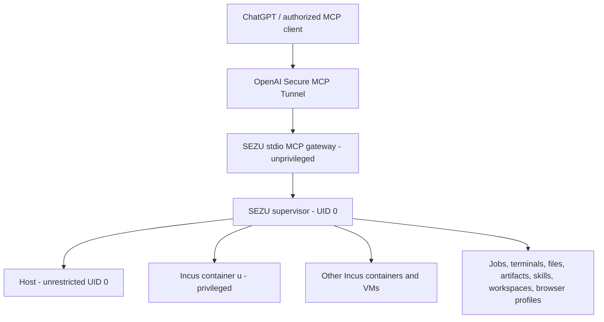

# SEZU Final Engineering Specification

**System, product, and command name:** `sezu`  
**Repository:** `StealthEyeLLC/sezu`  
**Default branch:** `main`  
**Initial release:** `0.1.0`  
**Wire contract:** `SEZU1/1.0.0`  
**Target platform:** OVH VPS, `amd64`, Ubuntu 24.04 LTS  
**Specification baseline:** 2026-08-04  
**Status:** Canonical implementation contract  
**Supersession:** This document supersedes every earlier SEZU engineering specification, planner, capability proposal, and phase plan.

> SEZU is an owner-controlled, standalone, unrestricted root execution system. It performs requested work directly through one MCP tool. It does not add policy, approval, reporting, evidence, audit, or verification machinery.

## 1. Product contract

SEZU gives ChatGPT and other authorized MCP clients direct control of:

- the Ubuntu host as unrestricted UID 0;
- the privileged Incus system container `u`;
- additional Incus containers and virtual machines;
- durable noninteractive jobs and direct process control;
- arbitrary reconnectable named terminals;
- unrestricted files, directories, transfers, and large artifacts;
- reusable global and project-local skills;
- workspace presets and saved operation macros;
- persistent named Playwright browser profiles;
- disposable task cells cloned from the golden `u` image;
- native Incus instances, projects, profiles, remotes, images, storage, networks, devices, certificates, forwards, DNS zones, backups, and migrations;
- locked capability packs for programming, data, documents, media, WebAssembly, cross-platform builds, networking, cloud clients, machine images, CAD/3D, and binary/firmware work;
- on-demand service cells that are started only when requested.

SEZU exposes exactly one public MCP tool named `call_sezu`. Every native capability is selected by an `operation` value in the `sezu.*` namespace. Arbitrary work always remains possible through `sezu.exec`.

The ordinary default target is `u`. Supplying `target=host` executes immediately as unrestricted root on the VPS. Supplying `target=cell:<name>` operates inside the named Incus instance.

When this specification says the owner gains an ability, it means an authorized ChatGPT session can perform that work through `call_sezu`, subject only to the active platform's own rules and available connection.

## 2. Deliberate absences

SEZU does not contain or require:

- a command allowlist or denylist;
- a policy or command-classification engine;
- approval prompts or second-person confirmation;
- mandatory dry runs, previews, rehearsals, or change plans;
- mandatory idempotency keys;
- automatic snapshots before commands;
- automatic rollback;
- reports, report generators, audit trails, evidence bundles, receipt databases, or compliance exports;
- an observability stack or duplicate dashboard;
- artificial command, time, CPU, memory, storage, or concurrency quotas imposed by SEZU;
- automatic secret inference or output sanitization claims;
- a public MCP listener or inbound MCP port;
- a runtime dependency on Baby, `se-z`, Caddy, or any earlier control system;
- local language models, local embedding models, local transcription models, or local AI servers;
- Android SDKs, Android emulators, ADB, NDK, APK tooling, or Android build support;
- always-on Kubernetes, database, broker, notebook, reverse-engineering, or cloud services;
- extra build phases.

Normal operating state needed by a capability still exists: job state, terminal scrollback, browser profile data, workspace configuration, skill files, artifact metadata, and Incus state. SEZU does not duplicate it into another system.

## 3. Stable baseline

| Layer | Selected release line |
|---|---:|
| Host OS | Ubuntu 24.04 LTS |
| Host kernel | Ubuntu GA `6.8.0-136-generic` |
| Incus | `6.0.6` LTS |
| Incus package build | `1:6.0.6-ubuntu24.04-202603272003` |
| `u` userland | Ubuntu Noble cloud image `20260803_07:42` |
| Docker in `u` | Ubuntu `docker.io` `29.1.3-0ubuntu3~24.04.2` |
| SEZU runtime | Node.js `24.19.0` LTS |
| MCP SDK | `@modelcontextprotocol/sdk` `1.30.0` |
| MCP protocol | `2025-11-25` |
| OpenAI transport | `tunnel-client` `0.0.10` |
| Playwright | `1.62.1`, Chromium only |

Incus 7.x remains excluded from release `0.1.0` because the selected host remains on Ubuntu 24.04's GA 6.8 kernel. Ubuntu HWE, OEM, edge, and mainline kernels are also excluded.

All additional forge tools and service images are resolved to exact stable versions in Phase 0 and committed under `locks/`. No later phase resolves moving versions.

## 4. Target environment

| Property | Value |
|---|---|
| VPS | OVH `VPS-3 2027`, `ovh-index-body-1` |
| Region | Virginia, USA (`os-us-east-va-2`) |
| CPU | 6 vCores |
| RAM | 12 GB |
| Disk | One 100 GB virtual disk, ext4 root |
| IPv4 | `51.81.86.225` |
| IPv6 | `2604:2dc0:121:3e2::1/128` |
| IPv6 gateway | `2604:2dc0:121::1`, on-link |
| Hardware virtualization | `/dev/kvm` present |
| Existing construction path | Baby remains available until SEZU's independent tunnel works |

The installer does not remove or modify the existing Baby path. Baby is not imported into SEZU and is not a SEZU runtime dependency.

## 5. Topology and permanent services



Required permanent host units:

| Unit | User | Purpose |
|---|---|---|
| `sezu-supervisor.service` | `root` | Unix socket, execution, jobs, terminals, files, artifacts, skills, workspaces, profiles, and Incus control |
| `sezu-tunnel.service` | `sezu-tunnel` | Outbound OpenAI tunnel and stdio gateway child |

No capability pack creates another permanent host service. Docker continues to run inside `u`. Other servers exist only in explicitly launched cells or processes.

## 6. Filesystem and identities

```text
/opt/sezu/releases/0.1.0/
/opt/sezu/current -> /opt/sezu/releases/0.1.0
/opt/sezu/toolchains/
/opt/sezu/packs/
/opt/sezu/skills/
/etc/sezu/
/etc/sezu/credentials/
/etc/sezu/skills/
/var/lib/sezu/jobs/
/var/lib/sezu/terminals/
/var/lib/sezu/artifacts/
/var/lib/sezu/workspaces/
/var/lib/sezu/browser-profiles/
/var/lib/sezu/packs/
/var/lib/sezu/templates/
/var/lib/sezu/timers/
/var/lib/sezu/storage/
/var/cache/sezu/sources/
/run/sezu/
/var/log/sezu/
```

| Identity | Purpose |
|---|---|
| `root` | Supervisor, host execution, Incus control, job/process/storage control |
| `sezu-tunnel` | Tunnel client and stdio MCP gateway |
| `sezu` group | Access to `/run/sezu/supervisor.sock` |

The supervisor socket is `/run/sezu/supervisor.sock`, owned by `root:sezu`, mode `0660`. The gateway-to-supervisor boundary is process separation, not a command policy.

## 7. Public MCP contract

```json
{
  "name": "call_sezu",
  "input": {
    "operation": "string",
    "target": "u | host | cell:<name>",
    "args": "operation-specific object",
    "idempotency_key": "optional string"
  }
}
```

`target` is optional and resolves from the active workspace or the configured default.

Every response uses the SEZU envelope:

```json
{
  "ok": true,
  "protocol": "SEZU1/1.0.0",
  "request_id": "opaque UUID",
  "operation": "sezu.exec",
  "target": "u",
  "status": "completed | running | failed | cancelled | interrupted | paused",
  "handle": "optional opaque handle",
  "exit_code": 0,
  "signal": null,
  "stdout": "bounded inline output",
  "stderr": "bounded inline output",
  "truncated": false,
  "artifacts": [],
  "error": null
}
```

Input and output streams are binary-safe. Large data is transferred by handles and ranges rather than base64-expanding whole files through ChatGPT.

## 8. Native operation families

The exact catalog is normative in `docs/OPERATION_CATALOG.md`. Native operations cover:

- discovery and version;
- synchronous and durable execution;
- process and cgroup control;
- arbitrary named terminals;
- files, directory trees, archives, URLs, and cross-target transfers;
- resumable artifacts;
- workspaces, skills, macros, and capability packs;
- persistent browser profiles;
- cells and VMs;
- Incus projects, profiles, remotes, certificates, storage, volumes, networks, forwards, DNS, devices, images, snapshots, backups, and migration;
- named task, service, and VM templates;
- timers and explicit backup operations.

Generic root administration, systemd, mounts, loop devices, partitions, filesystems, SSH tunnels, WireGuard, proxies, and arbitrary third-party CLIs remain available directly through `sezu.exec`. SEZU does not add wrappers merely to make the operation count larger.

## 9. Execution, jobs, and processes

`sezu.exec` accepts argv or an exact shell command and supports:

- target, cwd, environment additions/removals, and stdin bytes or artifact handle;
- synchronous, streaming, terminal, or durable execution;
- optional caller-selected timeout;
- binary-safe stdout and stderr;
- inline output limits with artifact spillover;
- explicit CPU affinity, nice value, and cgroup placement when requested.

Durable jobs run under the selected target's systemd or equivalent process manager. They survive gateway and tunnel disconnects. The actual exit cause is returned as exit code, signal, timeout, cancellation, interruption, or pause state.

Native process operations can inspect a process tree, send any Unix signal, pause, resume, change priority, change CPU affinity, and apply caller-requested cgroup properties. There is no hidden runtime ceiling.

## 10. Terminals

The four initial lanes remain defaults:

```text
u:main
u:build
u:debug
host:main
```

They are not a limit. Authorized callers may create any number of named terminal lanes per target, subject only to actual host resources.

Terminals support:

- arbitrary names and workspace association;
- multiple terminals per target;
- multiple readers;
- reconnectable byte cursors;
- binary-safe input and output;
- exact resize, interrupt, close, and recreate;
- persistent scrollback needed for reconnection.

A target or VPS reboot recreates configured lanes but cannot restore the memory of the prior shell process.

## 11. Files, transfers, archives, and artifacts

File operations have no path allowlist and act as root in the selected target.

SEZU supports:

- file and directory read, write, move, copy, remove, mkdir, metadata, chmod, chown, links, and range access;
- recursive directory-tree transfer;
- direct host to `u`, `u` to host, cell to cell, container to VM, and artifact to target transfer;
- resumable uploads and downloads;
- optional preservation of ownership, mode, timestamps, hard links, symlinks, sparse regions, ACLs, and extended attributes;
- archive create/extract/stream for tar, zip, 7z, cpio, and squashfs where the target tool supports it;
- direct URL, Git, OCI, S3-compatible, and existing-artifact imports;
- direct exports to local paths, targets, artifacts, URLs, and configured S3-compatible destinations.

Cross-target copies move bytes on the VPS or destination path. They do not route the complete payload through ChatGPT.

Artifacts are content-addressed and range-readable. Artifact upload uses begin, chunk, finalize, and abort operations so large transfers can resume.

## 12. Workspaces, skills, macros, and packs

### 12.1 Workspaces

A workspace is a repository or directory with optional `.sezu/workspace.yaml` configuration. It may define:

- default target;
- terminal names;
- browser profile;
- enabled skills and packs;
- environment additions/removals;
- mounts and persistent paths;
- task-cell template;
- exact project tool versions;
- saved macros.

Workspace settings reduce repeated setup. They do not restrict root execution and may always be overridden per call.

### 12.2 Skills

A skill is a reusable directory containing a manifest, executable entrypoint, scripts, templates, and optional assets. Skills may be:

- built into `/opt/sezu/skills`;
- owner-installed under `/etc/sezu/skills`;
- project-local under `.sezu/skills`;
- installed from an explicit Git ref, local artifact, or OCI artifact.

SEZU can list, inspect, install, remove, and run skills. Skills execute through ordinary SEZU operations and do not create a second public MCP tool.

### 12.3 Macros

Macros are saved operation compositions under `.sezu/macros/` or `/etc/sezu/macros/`. A macro may run operations sequentially, in parallel, or across multiple targets and may invoke skills, transfers, terminals, browser profiles, and task cells.

Macros are owner-authored convenience, not a policy or approval engine.

### 12.4 Capability packs

A capability pack is an exact locked group of tools or a template image. Packs can be installed into `u`, a persistent workspace cell, or a disposable task cell. Heavy or rarely used packs are not forced into the base image.

Pack installation consumes only Phase 0 lock data. It does not resolve `latest` at runtime.

## 13. Persistent browser profiles

Playwright Chromium remains the browser engine. Firefox and WebKit are not preinstalled.

SEZU browser profiles preserve, when requested:

- cookies and authenticated sessions;
- local storage and IndexedDB state;
- permissions;
- locale, timezone, viewport, device, and geolocation settings;
- downloads and upload staging;
- multiple tabs and browser context state.

Profiles can be global or workspace-associated. A profile is data, not a running service. Browser processes start only when requested and close when the operation or terminal is closed unless the caller explicitly leaves one running.

Supported work includes navigation, clicking, typing, drag/drop, JavaScript execution, DOM extraction, screenshots, PDF generation, uploads, downloads, request/response interception, WebSocket handling, and Chrome DevTools Protocol access.

## 14. Incus and disposable environments

Canonical Incus objects:

```text
Project:              sezu
Storage pool:         sezu-btrfs
Managed bridge:       sezu-br0
Primary profile:      sezu-u-power
Build instance:       u-build
Production instance:  u
Volumes:              u-work, u-cache
Golden image alias:   sezu-u-golden-0.1.0
```

SEZU exposes the practical Incus surface without duplicating Incus:

- create, start, stop, restart, pause, resume, rename, copy, refresh, rebuild, move, and delete containers and VMs;
- console, exec, files, cloud-init, QEMU Guest Agent, and raw QMP where applicable;
- projects, profiles, remotes, certificates, and enrolment tokens;
- networks, forwards, DNS zones/records, and devices;
- storage pools, custom volumes, attachment, copy, move, backup, import, and export;
- images, aliases, OCI imports, publish, launch, copy, and delete;
- snapshots, instance backup/export/import, and cross-remote migration;
- raw Incus REST calls through `sezu.incus.request` for features not yet given a convenience operation.

Disposable task cells are copy-on-write clones from the golden image or a named template. SEZU can import source, run work, promote selected output to `/work` or an artifact, and delete the cell. No automatic deletion occurs unless the caller requests it or the template explicitly defines a disposable lifecycle.

## 15. Forge capability packs

The normative pack list and installation policy are in `docs/CAPABILITY_PACKS.md` and `config/capabilities.yaml`.

The approved ability set includes:

- additional stable language ecosystems: Bun, Deno, .NET/C#/F#, PHP/Composer, Kotlin, Julia, R, Elixir/Erlang, Lua/LuaJIT, Dart, PowerShell, Swift for Linux, Fortran, Haskell, OCaml, Scala, and Clojure;
- WebAssembly and WASI: Wasmtime, Binaryen, Emscripten, WIT/component tooling, and `wasm-pack`;
- cross-platform builds: ARM, AArch64, RISC-V, musl, MinGW/Windows, QEMU user emulation, multi-architecture OCI, kernel modules, initramfs, ISO, and disk-image formats;
- notebooks and data: JupyterLab, Python/R/Julia/Deno/.NET kernels, NumPy, SciPy, pandas, Polars, scikit-learn, Arrow, Parquet, ORC, OpenCV, GDAL, DuckDB, dbt, Dask, and on-demand local Spark;
- documents: Tesseract, OCRmyPDF, qpdf, Ghostscript, Poppler, Pandoc, LibreOffice, Typst, LaTeX, Inkscape, Mermaid, PlantUML, and Graphviz;
- media and graphics: FFmpeg, ImageMagick, SoX, ExifTool, `yt-dlp`, OpenSCAD, and headless Blender;
- network and protocols: mitmproxy, TShark, Scapy, HTTPie, curl, `grpcurl`, `websocat`, `iperf3`, MQTT/AMQP/NATS clients, packet capture, network emulation, WireGuard, SSH tunnels, and socket relays;
- machine images: Packer, QEMU/KVM, cloud-init image recipes, OCI layouts, custom Incus images, root filesystems, raw/qcow2/VMDK/VHD images, and bootable ISO creation;
- cloud and external clients: AWS CLI, Azure CLI, Google Cloud CLI, Cloudflare Wrangler, GitHub CLI, GitLab CLI, Ansible, OpenTofu, Kubernetes clients, remote Incus, S3-compatible clients, and rclone;
- storage and transfer: MinIO client, Syncthing, SSHFS, NFS, SMB, `age`, `sops`, `gocryptfs`, DVC, and git-annex;
- non-Android binary and firmware work: Ghidra, radare2, Binwalk, Volatility, Capstone, Keystone, Unicorn, angr, `rr`, GDB tooling, libguestfs, and Sleuth Kit.

No local model or Android pack exists in release `0.1.0`.

## 16. On-demand service cells

SEZU includes locked templates, not always-on daemons, for:

- PostgreSQL;
- MariaDB;
- Redis;
- MongoDB;
- ClickHouse;
- Qdrant;
- Meilisearch;
- OpenSearch;
- RabbitMQ;
- NATS with JetStream;
- Redpanda-compatible Kafka;
- MinIO;
- a local OCI registry;
- temporary SMTP, DNS, HTTP, and reverse-proxy services.

A service cell starts only on explicit request. It may attach a named persistent custom volume and may be published only through an explicit network operation. Removing a service cell does not delete an attached persistent volume unless explicitly requested.

## 17. Production `u` image and pack placement

The base `u` image contains the existing core forge plus small, broadly useful additions:

- SEZU skill runtime and manifests;
- workspace/macro support;
- Playwright Chromium and profile support;
- direct transfer/archive tools;
- Jupyter and the data-core Python environment;
- document/PDF/OCR core;
- WebAssembly core;
- network/protocol core;
- machine-image core using existing QEMU/KVM plus Packer;
- shared cross-compilation prerequisites.

Large or specialized additions are on-demand packs:

- individual extra language ecosystems;
- large cloud SDKs;
- Blender/CAD assets;
- binary/firmware tools;
- local Spark;
- service-cell images.

This placement keeps the ordinary `u` image useful without consuming the entire 100 GB disk.

## 18. Networking and publication

The existing IPv4 configuration remains unchanged. Host IPv6 and the Incus bridge remain as defined for the original build:

```text
Bridge IPv4: 10.177.0.1/24 with NAT
Bridge IPv6: fd42:7365:7a75::1/64 with NAT when host IPv6 works
Docker pool:  172.30.0.0/16 divided into /24 networks inside u
```

`u` and cells receive unrestricted outbound networking. Inbound exposure occurs only when the owner invokes SEZU publication, Incus forward/proxy, SSH/WireGuard, or equivalent direct root operations.

The OpenAI tunnel remains outbound-only. There is no public MCP listener.

## 19. Input locking

Phase 0 creates the complete immutable release input set under `locks/`, including:

```text
locks/apt-host.tsv
locks/apt-u.tsv
locks/direct-artifacts.tsv
locks/npm-lock.json
locks/python-uv.lock
locks/playwright-browsers.json
locks/ubuntu-image.json
locks/capability-packs.json
locks/service-images.json
locks/licenses.json
```

Every entry records the exact version, source, immutable URL or repository snapshot, architecture, byte length where available, and digest. Package-manager lock files include the complete dependency closure.

Allowed inputs:

- stable general-availability releases;
- Ubuntu snapshot packages;
- exact Git tags or commits associated with a stable release;
- exact OCI image digests;
- exact language-package locks.

Disallowed inputs:

- `latest`, `stable`, or `current` moving tags at build time;
- nightly, alpha, beta, preview, development, or release-candidate builds;
- unpinned branches;
- installer scripts piped directly from the network into a shell;
- runtime package resolution in later phases.

## 20. Repository layout

```text
README.md
SEZU_FINAL_ENGINEERING_SPEC.md
config/
  capabilities.yaml
  skill.schema.json
  workspace.schema.json
  macro.schema.json
docs/
  BUILD_PLAN.md
  OPERATION_CATALOG.md
  CAPABILITY_PACKS.md
  project/
    00_SEZU_PROJECT_CHARTER.md
    01_SEZU_EXECUTION_DIRECTIVE.md
    02_SEZU_TURN_FAILURE_RESILIENCE.md
    03_SEZU_PHASE_PROMPT_STANDARD.md
locks/
skills/
templates/services/
src/
test/
scripts/
systemd/
```

The five ChatGPT Project source documents are this specification plus the four documents in `docs/project/`.

## 21. Seven-phase build plan

The build remains exactly seven phases.

### Phase 0 - Freeze release inputs

- resolve every core and capability-pack dependency to a stable exact version;
- download or locate immutable artifacts;
- generate package and image locks;
- create the repository structure and configuration schemas;
- commit the complete build input set.

Phase 0 does not modify the VPS runtime beyond temporary source retrieval needed to resolve locks.

### Phase 1 - Prepare the host

- install the locked Ubuntu host baseline and Incus 6.0.6 packages;
- configure the GA kernel, zram, modules, limits, storage backing, identities, directories, and systemd prerequisites;
- leave Baby and unrelated services untouched.

### Phase 2 - Configure networking and Incus

- configure host IPv6 and `sezu-br0`;
- create the `sezu` project, storage pool, profile, persistent volumes, and required devices;
- enable the full Incus object surface used by SEZU;
- create the reusable task/service/VM template structure.

### Phase 3 - Build the `u` forge

- launch `u-build` from the locked Ubuntu image;
- install the core forge and default capability packs;
- configure caches, Docker, Playwright profiles, workspace/skill paths, Jupyter, documents, WebAssembly, network tools, cross-build tools, and machine-image tools;
- cache locked on-demand pack inputs;
- publish `sezu-u-golden-0.1.0` and launch production `u` with persistent volumes.

### Phase 4 - Install SEZU

- build and install the gateway, supervisor, CLI, schemas, and systemd units;
- implement the complete operation catalog;
- install built-in skills, pack catalog, workspace support, browser profiles, cross-target transfers, disposable cells, Incus coverage, and service templates;
- keep local CLI and direct stdio operation available before tunnel activation.

### Phase 5 - Activate the outbound tunnel

- install the SEZU-specific tunnel ID, key, and workspace association;
- start `sezu-tunnel.service`;
- expose exactly one MCP tool, `call_sezu`;
- confirm that no public MCP listener exists.

### Phase 6 - Exercise the finished system

Run direct functional use of every capability family on the real target, repair defects, and leave the installed release matching this specification. This phase uses ordinary functional commands and state inspection only. It creates no report, evidence, audit, or verification subsystem.

## 22. Direct functional completion checks

Completion requires ordinary working use, not ceremony. At minimum:

- `call_sezu` runs unrestricted commands on `host`, `u`, and one additional cell;
- a durable job runs, streams output, receives stdin or a signal, and returns its actual end state;
- arbitrary named terminals reconnect and preserve byte cursors;
- a directory tree transfers directly among host, `u`, and a cell;
- a resumable artifact upload and range download work;
- a workspace loads its target, skills, terminal, macro, and browser profile;
- a built-in and a project-local skill run;
- a named browser profile preserves an authenticated or equivalent persistent session state;
- a disposable task cell is cloned, used, returns selected output, and is removed;
- representative Incus project/profile/storage/network/image/backup/migration operations work;
- one default capability pack and one on-demand pack work;
- one service cell starts, accepts a client connection, stops, and retains its explicitly attached data volume;
- document/OCR, data/Jupyter, WebAssembly, cross-platform build, media, network/protocol, machine-image, cloud-client, and non-Android binary/firmware abilities each complete one direct task;
- the tunnel exposes only `call_sezu` and Baby can be stopped without breaking SEZU.

Only the working state and normal command output are needed. No separate report or evidence package is produced.

## 23. Definition of done

SEZU `0.1.0` is done when:

1. the repository contains the complete implementation and exact locks;
2. the seven phases have been executed on the target VPS;
3. the direct functional completion checks pass;
4. the standalone `call_sezu` tunnel works without Baby;
5. the intended two permanent host services are the only SEZU permanent host services;
6. the repository and ChatGPT Project sources contain the same canonical contract;
7. no local-model or Android capability has been introduced;
8. no report, evidence, audit, verification, approval, policy, or rollback subsystem has been introduced.
